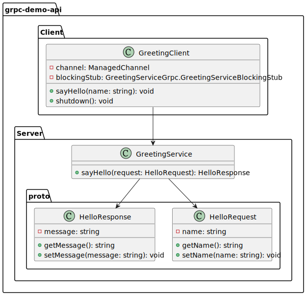

# grpc-lab

grpc 架構練習

- [grpc-lab](#grpc-lab)
  - [lab1-gRPC demo 練習](#lab1-grpc-demo-練習)

---

## [lab1-gRPC demo 練習](./doc/lab1_grpc_demo_simple.md)

這個 Demo 專案展示了使用 gRPC 架構進行服務通訊的基本原理和實現方式。專案使用 Java 語言和 Spring Boot 框架來搭建伺服器端和客戶端應用程式。

---
