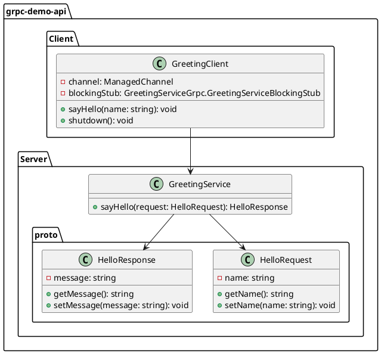

# lab1- gRPC Demo 專案

這個 Demo 專案展示了使用 gRPC 架構進行服務通訊的基本原理和實現方式。專案使用 Java 語言和 Spring Boot 框架來搭建伺服器端和客戶端應用程式。

- [lab1- gRPC Demo 專案](#lab1--grpc-demo-專案)
  - [功能描述](#功能描述)
  - [技術架構](#技術架構)
  - [專案架構](#專案架構)
    - [圖示](#圖示)
    - [plantuml](#plantuml)
  - [專案結構](#專案結構)
  - [實作過程](#實作過程)
    - [1. 建立空專案(spring boot)](#1-建立空專案spring-boot)
    - [2. 引入相關套件](#2-引入相關套件)
    - [3. 定義 Protocol Buffers 檔案](#3-定義-protocol-buffers-檔案)
    - [4. 編譯 Protocol Buffers 檔案](#4-編譯-protocol-buffers-檔案)
      - [4.1. 編譯方式](#41-編譯方式)
      - [4.2. 編譯後](#42-編譯後)
    - [5. 實作 Server 端跟 Client 端](#5-實作-server-端跟-client-端)
      - [5.1 Server](#51-server)
      - [5.2 Client](#52-client)
    - [6. 啟動 gRPC 伺服器](#6-啟動-grpc-伺服器)
  - [如何執行](#如何執行)

---

## 功能描述

這個 Demo 專案實現了一個簡單的問候服務，包括以下兩個功能：

1. Greeting Server：伺服器端應用程式，接收客戶端的請求，並返回相應的問候訊息。
2. Greeting Client：客戶端應用程式，向伺服器端發送問候請求，並接收伺服器端返回的問候訊息。

ps. 由於只是 Demo 練習，因此會在單一專案內寫 Server 以及 Client 的程式。

---

## 技術架構

專案使用以下技術和工具：

- Java：主要程式語言，用於編寫伺服器端和客戶端的程式碼。
- Spring Boot：用於搭建伺服器端和客戶端的應用程式，提供便捷的開發環境和功能。
- gRPC：用於定義服務和消息的 .proto 文件和編譯器，生成伺服器端和客戶端的程式碼。
- Protocol Buffers：用於定義消息的結構和格式，並生成相應的程式碼。

---

## 專案架構

### 圖示


### plantuml



---

## 專案結構

- 專案的結構如下：

```bash
grpc-demo
├── grpc-demo-api
│ ├── src
│ │ ├── main
│ │ │ ├── java/com/flamesunrises/demo/service
│ │ │ │ ├── GreetingService.proto # 定義問候服務的 .proto 文件
│ │ │ ├── java/com/flamesunrises/demo/client
│ │ │ │ ├── GreetingServer.java # 客戶端主程式
│ │ │ ├── resources
│ │ │ │ ├── application.properties # 伺服器端應用程式的配置文件
│ │ │ ├── java
│ │ │ │ ├── propto
│ │ │ │ | ├── hello.proto # proto 文件
│ ├── pom.xml # Maven 項目配置文件
```

---

## 實作過程

### 1. 建立空專案(spring boot)

- 指令

```bash
mvn archetype:generate \
  -DarchetypeGroupId=io.grpc \
  -DarchetypeArtifactId=grpc-archetype \
  -DarchetypeVersion=1.40.1 \
  -DgroupId=com.flamesunrises \
  -DartifactId=grpc-demo-api \
  -Dversion=1.0-SNAPSHOT \
  -Dpackage=com.flamesunrises.grpc.demo.api \
  -DinteractiveMode=false

```

### 2. 引入相關套件

- gRPC 相關依賴項
  用於 gRPC 的遠程通訊和程式生成

  ```xml
  <dependency>
    <groupId>io.grpc</groupId>
    <artifactId>grpc-netty-shaded</artifactId>
    <version>${io.grpc.version}</version>
    <scope>runtime</scope>
  </dependency>
  <dependency>
    <groupId>io.grpc</groupId>
    <artifactId>grpc-protobuf</artifactId>
    <version>${io.grpc.version}</version>
  </dependency>
  <dependency>
    <groupId>io.grpc</groupId>
    <artifactId>grpc-stub</artifactId>
    <version>${io.grpc.version}</version>
  </dependency>
  ```

- Protocol Buffers 相關依賴項

  - 用於 Protocol Buffers 的編譯和使用

  ```xml
  <dependency>
    <groupId>com.google.protobuf</groupId>
    <artifactId>protobuf-java</artifactId>
    <version>${protobuf-java.version}</version>
  </dependency>
  <dependency>
    <groupId>com.google.protobuf</groupId>
    <artifactId>protobuf-java-util</artifactId>
    <version>${protobuf-java.version}</version>
  </dependency>
  ```

- 建構設定

  - `<extensions>` 區塊中使用了 os-maven-plugin 插件，用於跨平台支援。

    ```xml
    <extensions>
      <extension>
        <groupId>kr.motd.maven</groupId>
        <artifactId>os-maven-plugin</artifactId>
        <version>1.7.1</version>
      </extension>
    </extensions>
    ```

  - `<plugins>` 區塊中使用了 protobuf-maven-plugin 插件，用於 Protocol Buffers 的編譯和生成 gRPC 相關程式碼。

    - 相關參數說明
      - `<protocArtifact>`：指定了 Protocol Buffers 的編譯器 protoc 的相關信息。這裡使用了 Google 提供的 protoc 工具版本 3.18.1，並使用 ${os.detected.classifier} 表示根據系統平台自動選擇適用的二進制文件。
      - `<pluginArtifact>`：指定了 gRPC 相關程式碼生成工具 protoc-gen-grpc-java 的相關信息。這裡使用了 gRPC 的版本號 ${io.grpc.version}，同樣使用 ${os.detected.classifier} 表示根據系統平台自動選擇適用的二進制文件。

    ```xml
    <plugin>
        <groupId>org.xolstice.maven.plugins</groupId>
        <artifactId>protobuf-maven-plugin</artifactId>
        <version>0.6.1</version>
        <configuration>
        <protocArtifact>com.google.protobuf:protoc:3.18.1:exe:${os.detected.classifier}
        </protocArtifact>
        <pluginId>grpc-java</pluginId>
        <pluginArtifact>
            io.grpc:protoc-gen-grpc-java:${io.grpc.version}:exe:${os.detected.classifier}
        </pluginArtifact>
        </configuration>
        <executions>
            <execution>
                <goals>
                    <goal>compile</goal>
                    <goal>compile-custom</goal>
                </goals>
            </execution>
        </executions>
    </plugin>
    ```

### 3. 定義 Protocol Buffers 檔案

```proto
syntax = "proto3";

package com.flamesunrises.demo.service;

service GreetingService {
rpc SayHello (HelloRequest) returns (HelloResponse);
}

message HelloRequest {
string name = 1;
}

message HelloResponse {
string message = 1;
}
```

### 4. 編譯 Protocol Buffers 檔案

#### 4.1. 編譯方式

此步驟可以有兩種方法,如下所述

1. 指令方式

   ```bash
   protoc --java_out=src/main/java/hello.proto
   ```

2. 透過 maven compile 自動執行

   ```xml

   ```

#### 4.2. 編譯後

使用 Protocol Buffers 編譯器（protoc）編譯 .proto 檔案時，它會根據 .proto 檔案中的定義生成相應的 Java 類別。而編譯後的檔案名稱會以`Grpc `結尾

例如以 lab1 為例我們會產生`GreetingServiceGrpc`的檔案(com/flamesunrises/demo/service/GreetingServiceGrpc.java)

- 包含了以下兩個主要元素：

  - 對外暴露的服務介面（Interface）：

    GreetingServiceGrpc 類別會生成一個介面，該介面定義了客戶端與伺服器之間的溝通方法。這些方法的命名和參數是根據 .proto 檔案中的服務定義自動生成的。

  - 內部實現類別（Impl）：

    GreetingServiceGrpc 類別也包含了內部實現類別，該類別繼承自生成的服務介面並實現了其中定義的方法。這個內部實現類別是您自己實現的，用於處理客戶端的請求並返回相應的結果。

### 5. 實作 Server 端跟 Client 端

#### 5.1 Server

```java
public class GreetingServer {
  private Server server;

  public static void main(String[] args) throws IOException, InterruptedException {
    GreetingServer greetingServer = new GreetingServer();
    greetingServer.start();
    greetingServer.blockUntilShutdown();
  }

  private void start() throws IOException {
    int port = 50051;
    server = ServerBuilder.forPort(port)
        .addService((BindableService) new GreetingServiceImpl())
        .build()
        .start();

    System.out.println("Server started, listening on port " + port);
    Runtime.getRuntime().addShutdownHook(new Thread(() -> {
      System.out.println("Shutting down gRPC server");
      GreetingServer.this.stop();
      System.out.println("Server shut down");
    }));
  }

  private void stop() {
    if (server != null) {
      server.shutdown();
    }
  }

  private void blockUntilShutdown() throws InterruptedException {
    if (server != null) {
      server.awaitTermination();
    }
  }

  static class GreetingServiceImpl extends GreetingServiceGrpc.GreetingServiceImplBase {
    @Override
    public void sayHello(HelloRequest request, StreamObserver<HelloResponse> responseObserver) {
      String name = request.getName();
      System.out.println("GreetingServiceImpl name = " + name);
      String message = "Hello, " + name + "!";

      HelloResponse response = HelloResponse.newBuilder()
          .setMessage(message)
          .build();

      responseObserver.onNext(response);
      responseObserver.onCompleted();
    }
  }
}
```

#### 5.2 Client

```java
public class GreetingClient {

  private final ManagedChannel channel;
  private final GreetingServiceGrpc.GreetingServiceBlockingStub blockingStub;

  public GreetingClient(String host, int port) {
    channel = ManagedChannelBuilder.forAddress(host, port)
        .usePlaintext()
        .build();

    blockingStub = GreetingServiceGrpc.newBlockingStub(channel);
  }

  public void sayHello(String name) {
    HelloRequest request = HelloRequest.newBuilder()
        .setName(name)
        .build();

    HelloResponse response = blockingStub.sayHello(request);

    System.out.println("Server response: " + response.getMessage());
  }

  public void shutdown() {
    channel.shutdown();
  }

  public static void main(String[] args) {
    GreetingClient client = new GreetingClient("localhost", 50051);
    System.out.println("GreetingClient.main");
    // 呼叫 gRPC 服務
    client.sayHello("John Doe");
    System.out.println("client sayHello = " + "John Doe");

    // 關閉客戶端
    client.shutdown();
  }
}
```

### 6. 啟動 gRPC 伺服器

---

## 如何執行

1. 確保您的開發環境中已安裝 Java 和 Maven。

2. 使用 Git 或下載 ZIP 檔案，將專案複製到您的本地環境。

3. 打開終端機，進入 grpc-demo-api 目錄，執行以下命令啟動伺服器端應用程式：

   - Server

   ```bash
   mvn clean package
   cd target
   java -cp grpc-demo-api-1.0-SNAPSHOT.jar com.flamesunrises.grpc.demo.api.GreetingServer
   ```

   - Client

   ```bash
   mvn clean package
   cd target
   java -cp grpc-demo-api-1.0-SNAPSHOT.jar com.flamesunrises.grpc.demo.api.GreetingClient
   ```

4. 執行結果

   ```log
    Server started, listening on port 50051
    16:37:12.920 [grpc-nio-worker-ELG-3-1] DEBUG io.grpc.netty.shaded.io.netty.buffer.AbstractByteBuf - -Dio.grpc.netty.shaded.io.netty.buffer.checkAccessible: true
    16:37:12.920 [grpc-nio-worker-ELG-3-1] DEBUG io.grpc.netty.shaded.io.netty.buffer.AbstractByteBuf - -Dio.grpc.netty.shaded.io.netty.buffer.checkBounds: true
    16:37:12.922 [grpc-nio-worker-ELG-3-1] DEBUG io.grpc.netty.shaded.io.netty.util.ResourceLeakDetectorFactory - Loaded default ResourceLeakDetector: io.grpc.netty.shaded.io.netty.util.ResourceLeakDetector@507e6f06
    16:37:13.011 [grpc-nio-worker-ELG-3-1] DEBUG io.grpc.netty.shaded.io.grpc.netty.NettyServerHandler - [id: 0x78f145bb, L:/127.0.0.1:50051 - R:/127.0.0.1:56187] OUTBOUND SETTINGS: ack=false settings={MAX_CONCURRENT_STREAMS=2147483647, INITIAL_WINDOW_SIZE=1048576, MAX_HEADER_LIST_SIZE=8192}
    16:37:13.016 [grpc-nio-worker-ELG-3-1] DEBUG io.grpc.netty.shaded.io.netty.util.Recycler - -Dio.netty.recycler.maxCapacityPerThread: 4096
    16:37:13.016 [grpc-nio-worker-ELG-3-1] DEBUG io.grpc.netty.shaded.io.netty.util.Recycler - -Dio.netty.recycler.maxSharedCapacityFactor: 2
    16:37:13.016 [grpc-nio-worker-ELG-3-1] DEBUG io.grpc.netty.shaded.io.netty.util.Recycler - -Dio.netty.recycler.linkCapacity: 16
    16:37:13.016 [grpc-nio-worker-ELG-3-1] DEBUG io.grpc.netty.shaded.io.netty.util.Recycler - -Dio.netty.recycler.ratio: 8
    16:37:13.016 [grpc-nio-worker-ELG-3-1] DEBUG io.grpc.netty.shaded.io.netty.util.Recycler - -Dio.netty.recycler.delayedQueue.ratio: 8
    16:37:13.025 [grpc-nio-worker-ELG-3-1] DEBUG io.grpc.netty.shaded.io.grpc.netty.NettyServerHandler - [id: 0x78f145bb, L:/127.0.0.1:50051 - R:/127.0.0.1:56187] OUTBOUND WINDOW_UPDATE: streamId=0 windowSizeIncrement=983041
    16:37:13.037 [grpc-nio-worker-ELG-3-1] DEBUG io.grpc.netty.shaded.io.grpc.netty.NettyServerHandler - [id: 0x78f145bb, L:/127.0.0.1:50051 - R:/127.0.0.1:56187] INBOUND SETTINGS: ack=false settings={ENABLE_PUSH=0, MAX_CONCURRENT_STREAMS=0, INITIAL_WINDOW_SIZE=1048576, MAX_HEADER_LIST_SIZE=8192}
    16:37:13.038 [grpc-nio-worker-ELG-3-1] DEBUG io.grpc.netty.shaded.io.grpc.netty.NettyServerHandler - [id: 0x78f145bb, L:/127.0.0.1:50051 - R:/127.0.0.1:56187] OUTBOUND SETTINGS: ack=true
    16:37:13.039 [grpc-nio-worker-ELG-3-1] DEBUG io.grpc.netty.shaded.io.grpc.netty.NettyServerHandler - [id: 0x78f145bb, L:/127.0.0.1:50051 - R:/127.0.0.1:56187] INBOUND WINDOW_UPDATE: streamId=0 windowSizeIncrement=983041
    16:37:13.049 [grpc-nio-worker-ELG-3-1] DEBUG io.grpc.netty.shaded.io.grpc.netty.NettyServerHandler - [id: 0x78f145bb, L:/127.0.0.1:50051 - R:/127.0.0.1:56187] INBOUND SETTINGS: ack=true
    16:37:13.076 [grpc-nio-worker-ELG-3-1] DEBUG io.grpc.netty.shaded.io.grpc.netty.NettyServerHandler - [id: 0x78f145bb, L:/127.0.0.1:50051 - R:/127.0.0.1:56187] INBOUND HEADERS: streamId=3 headers=GrpcHttp2RequestHeaders[:path: /com.flamesunrises.demo.service.GreetingService/SayHello, :authority: localhost:50051, :method: POST, :scheme: http, te: trailers, content-type: application/grpc, user-agent: grpc-java-netty/1.40.1, grpc-accept-encoding: gzip] streamDependency=0 weight=16 exclusive=false padding=0 endStream=false
    16:37:13.100 [grpc-nio-worker-ELG-3-1] DEBUG io.grpc.netty.shaded.io.grpc.netty.NettyServerHandler - [id: 0x78f145bb, L:/127.0.0.1:50051 - R:/127.0.0.1:56187] INBOUND DATA: streamId=3 padding=0 endStream=true length=15 bytes=000000000a0a084a6f686e20446f65
    16:37:13.100 [grpc-nio-worker-ELG-3-1] DEBUG io.grpc.netty.shaded.io.grpc.netty.NettyServerHandler - [id: 0x78f145bb, L:/127.0.0.1:50051 - R:/127.0.0.1:56187] OUTBOUND PING: ack=false bytes=1234
    16:37:13.102 [grpc-nio-worker-ELG-3-1] DEBUG io.grpc.netty.shaded.io.grpc.netty.NettyServerHandler - [id: 0x78f145bb, L:/127.0.0.1:50051 - R:/127.0.0.1:56187] INBOUND PING: ack=true bytes=1234
    GreetingServiceImpl name = John Doe
   ```

   - Client

   ```log
    Server response: Hello, John Doe!
    client sayHello = John Doe
    16:37:13.175 [grpc-nio-worker-ELG-1-2] DEBUG io.grpc.netty.shaded.io.grpc.netty.NettyClientHandler - [id: 0xea157e89, L:/127.0.0.1:56187 - R:localhost/127.0.0.1:50051] OUTBOUND GO_AWAY: lastStreamId=0 errorCode=0 length=0 bytes=
   ```
